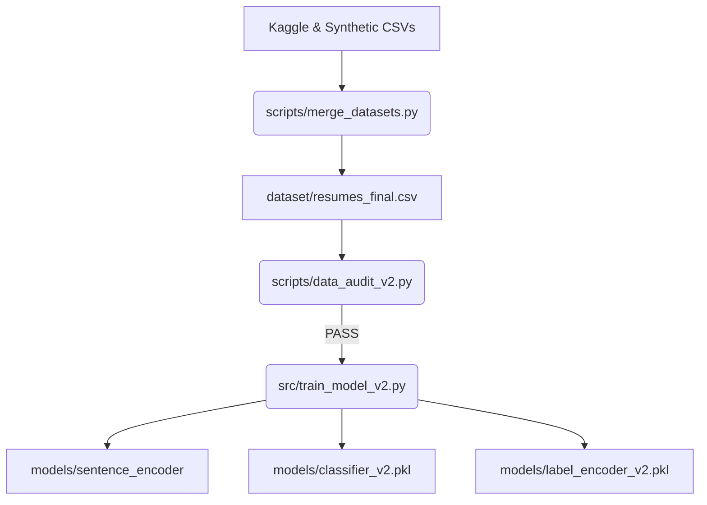

# Resume Screening & Job Fit Prediction — Project Overview

This document provides a comprehensive technical overview of the **Resume Screening & Job Fit Prediction** system. It details the system architecture, directory structures, tech stack, machine learning pipeline, API endpoints, interactive frontend dashboard, and execution instructions.

---

## 🛠️ Technology Stack

The project is structured as a decoupled full-stack application (FastAPI backend + React frontend) backed by a machine learning inference pipeline.

### Machine Learning & Data Science (Python)
*   **Text Embedding**: [SentenceTransformers](https://sbert.net/) (`all-MiniLM-L6-v2`) generating dense 384-dimensional semantic vectors.
*   **Classification**: Hyperparameter-tuned **Logistic Regression** (optimized via `GridSearchCV` on the $C$ parameter).
*   **Data Manipulation**: `pandas`, `numpy`.
*   **Model Evaluation**: `scikit-learn` (for stratified split, label encoding, classification metrics).
*   **Serialization**: `joblib` for model pickling.

### Backend API Server (Python)
*   **Framework**: [FastAPI](https://fastapi.tiangolo.com/) for building high-performance, asynchronous REST APIs.
*   **Web Server**: [Uvicorn](https://www.uvicorn.org/) ASGI server.
*   **Document Parsers**: [PyMuPDF](https://pymupdf.readthedocs.io/) (`fitz`) for PDF text extraction and `python-docx` for Word documents.
*   **Validation**: `Pydantic v2` schemas.

### Frontend Dashboard (TypeScript / React)
*   **Build Tool**: [Vite](https://vite.dev/) for fast development and bundling.
*   **UI Library**: [React 19](https://react.dev/).
*   **Styling**: [Tailwind CSS v4](https://tailwindcss.com/) with custom glassmorphic variables.
*   **Data Visualization**: [Recharts](https://recharts.org/) (`RadarChart`) for visual representations of career area scores.
*   **Icons**: [Lucide React](https://lucide.dev/).
*   **API Client**: [Axios](https://axios-http.com/) for communication with the backend.

---

## 📁 Directory Structure & File Explanations

Here is the directory structure of the root workspace `nlp-dl-project/`:

```
nlp-dl-project/
│
├── backend/                           # FastAPI Backend Application
│   ├── main.py                        # API endpoints & application lifespans
│   ├── parser.py                      # PDF/DOCX parsers & cleaning logic
│   └── requirements.txt               # Backend Python package dependencies
│
├── dataset/                           # Raw & Processed Datasets
│   ├── Resume.csv                     # Large Kaggle resume dataset (~56MB)
│   ├── UpdatedResumeDataSet.csv       # Standard Kaggle resume dataset (~3MB)
│   ├── resumes.csv                    # Initial toy dataset (30 samples, 14 roles)
│   ├── resumes_v2.csv                 # Synthetic backup dataset for low-sample classes
│   └── resumes_final.csv              # Final cleaned, balanced dataset (918 samples)
│
├── frontend/                          # Vite + React + TypeScript Frontend
│   ├── src/
│   │   ├── api/
│   │   │   └── predict.ts             # Axios API calls to backend endpoints
│   │   ├── components/
│   │   │   ├── CategoryGrid.tsx       # Grid of 14 supported roles
│   │   │   ├── DropZone.tsx           # Drag-and-drop resume uploader
│   │   │   ├── Header.tsx             # Navbar with dark/light mode toggle
│   │   │   ├── ResultCard.tsx         # Primary predicted role & confidence scoring
│   │   │   ├── ResumeDNA.tsx          # Career cluster radar chart & skill gaps
│   │   │   └── Top3Chart.tsx          # Bar chart of top-3 role recommendations
│   │   ├── types/
│   │   │   └── index.ts               # TypeScript interface declarations
│   │   ├── App.tsx                    # Main app layout and event/state coordination
│   │   ├── App.css                    # Tailored glassmorphism and animation styles
│   │   └── index.css                  # Core CSS and Tailwind directives
│   ├── package.json                   # Frontend script & package declarations
│   └── vite.config.ts                 # Vite compiler configuration
│
├── models/                            # Serialized ML Models & Tokenizers
│   ├── sentence_encoder/              # Cached local copy of sentence-transformers
│   ├── classifier_v2.pkl              # Tuned Logistic Regression model
│   └── label_encoder_v2.pkl           # Target labels encoder mapping
│
├── notebooks/                         # Exploratory & Development Jupyter Notebooks
│   ├── 01_eda.ipynb                   # Exploratory Data Analysis
│   ├── 02_text_preprocessing.ipynb    # Clean, tokenize, and pad toy samples
│   ├── 03_model_training.ipynb        # Train initial Bi-LSTM on small dataset
│   └── 04_demo_prediction.ipynb       # Inference test on Bi-LSTM models
│
├── results/                           # Logs, Evaluation Reports, and Metrics
│   ├── metrics_v3.txt                 # Model retraining & validation/test metrics
│   └── confusion_matrix.png           # Confusion matrix from training phases
│
├── scripts/                           # Data-merge & Auditing Utilities
│   ├── data_audit_v2.py               # Confirm dataset balance & validity (PASS check)
│   └── merge_datasets.py              # Balance, map categories, clean, and deduplicate
│
├── src/                               # Backend Python Core Source Code
│   ├── career_dna.py                  # Resume DNA & Skill Gap analysis module
│   ├── predict_v2.py                  # Predictor service with caching loaders
│   ├── preprocess.py                  # Text cleaning operations
│   └── train_model_v2.py              # ML retraining script with GridSearchCV
│
├── README.md                          # Primary README
├── walkthrough.md                     # Walkthrough of recent tasks (Task 1 & 2)
└── project_overview.md                # (This file) Complete technical documentation
```

---

## ⚙️ How It Works (The Core Workflows)

### 1. Data Pipeline & Model Training
The dataset pipeline transforms raw text resumes into a predictive classifier:
1.  **Merging & Balancing (`scripts/merge_datasets.py`)**:
    *   Loads resumes from `UpdatedResumeDataSet.csv`, `Resume.csv`, and backup `resumes_v2.csv`.
    *   Maps raw resume labels to **14 standard IT and business categories**.
    *   Strips HTML, normalizes spacing, filters short documents (<50 words), and deduplicates text.
    *   Balances the dataset by capping dominant classes at 300 samples and backfilling low-sample classes with synthetic resumes to ensure a **minimum of 40 samples per category**.
    *   Output is stored in `dataset/resumes_final.csv` (918 samples).
2.  **Validation Audit (`scripts/data_audit_v2.py`)**:
    *   Verifies that the minimum sample criteria is satisfied for all classes.
3.  **Model Training (`src/train_model_v2.py`)**:
    *   Splits the balanced dataset into a **70% training / 15% validation / 15% testing** stratified split.
    *   Generates sentence embeddings for each resume using the `all-MiniLM-L6-v2` transformer model (yielding a dense 384-dimensional vector per resume).
    *   Runs a `GridSearchCV` on a `LogisticRegression` classifier to find the optimal regularization value `C` (tuned to `C = 10.0`).
    *   Achieves **97.10% Validation Accuracy** and **95.65% Test Accuracy**.
    *   Saves the tuned classifier to `models/classifier_v2.pkl` and the label encoder to `models/label_encoder_v2.pkl`.



### 2. Backend Prediction Server
The FastAPI backend (`backend/main.py`) acts as the API gateway:
*   On startup, the lifespan hook pre-loads the Sentence Transformer, Logistic Regression classifier, and Label Encoder into memory caching (`src/predict_v2.py`).
*   **Text Endpoint (`/predict/text`)**: Receives JSON payloads with raw resume text.
*   **File Endpoint (`/predict/file`)**: Accepts PDF or DOCX file uploads.
    *   Extracts text using `backend/parser.py` (which leverages PyMuPDF for PDFs and python-docx for Word docs).
    *   Enforces a strict **5MB file size limit**.
*   **Inference Pipeline**:
    *   Converts the extracted/cleaned resume text into a 384-dimensional vector.
    *   Predicts class probabilities using the Logistic Regression model.
    *   Extracts the top-1 predicted class, confidence, and top-3 candidates.
    *   Passes the resume text, predicted category, and full probability array to `src/career_dna.py` to compile Resume DNA analytics.
    *   Returns a unified JSON response containing primary predictions, confidence percentages, top-3 alternatives, word count, processing time, and the Resume DNA object.

### 3. Resume DNA Analytics (`src/career_dna.py`)
This feature compiles detailed career insights and keyword matching:
*   **Career Area Radar Mapping**: Groups the 14 supported job categories into **6 Core Clusters**:
    *   *Data Science*
    *   *Backend & Python*
    *   *DevOps & Cloud*
    *   *Frontend & Mobile*
    *   *Security*
    *   *Business*
    *   Computes an average probability percentage for each cluster.
*   **Skill Keyword Audit**: Defines a vocabulary of **15 essential keywords** for each of the 14 categories.
    *   Scans the resume for these keywords to identify **Detected Skills** vs. **Missing Skills**.
    *   Computes a **Keyword Fit Score** ($\% = \frac{\text{detected keywords}}{\text{total keywords}} \times 100$).
*   **Alternative Career Paths**: Finds the top 3 alternative job roles (sorted by probability) and calculates the number of missing skill keywords the candidate would need to add to match those roles.

### 4. Interactive Frontend Dashboard (`frontend/`)
An interactive Glassmorphic SPA built to consume the backend API:
1.  **DropZone (`DropZone.tsx`)**: Prompts the user to drag and drop a PDF/DOCX file, or paste raw text.
2.  **ResultCard & Top3Chart**: Displays the primary role prediction with high-impact color-coded confidence levels and visualizes alternative roles in a progress bar.
3.  **ResumeDNA (`ResumeDNA.tsx`)**:
    *   *Radar Chart*: Utilizes Recharts `RadarChart` to plot career cluster scores in dark or light mode.
    *   *Score indicator*: Visualizes fit classification (Strong, Moderate, or Skills Gap Observed) with responsive borders.
    *   *Pills Grid*: Renders green badges for detected skills and red warning badges for missing skills.
    *   *Interactive Paths*: Lists alternative paths. Clicking a path triggers a custom window event (`dna-role-click`) which details specific skills and gap metrics.

---

## 👨‍💻 Key Code Implementation Details

### Model Inference: [predict_v2.py](file:///c:/Users/sudha/OneDrive/Desktop/MAIN/nlp-dl-project/src/predict_v2.py)
Loads serialized classifiers and generates predictions:
```python
def predict(text: str) -> dict:
    _load_assets() # Loaded once and cached
    embedding = _encoder.encode([text])[0]
    embedding = np.expand_dims(embedding, axis=0)
    
    probs = _classifier.predict_proba(embedding)[0]
    top_class_idx = np.argmax(probs)
    confidence = float(probs[top_class_idx])
    predicted_label = _label_encoder.classes_[top_class_idx]
    
    # Sort top 3 predicted classes
    top_3_indices = np.argsort(probs)[-3:][::-1]
    top3_list = [{"label": str(_label_encoder.classes_[idx]), "score": float(probs[idx])} for idx in top_3_indices]
    
    # Store all probabilities for Resume DNA career mapping
    all_probs = {str(_label_encoder.classes_[i]): float(probs[i]) for i in range(len(_label_encoder.classes_))}
    
    return {
        "label": predicted_label,
        "confidence": confidence,
        "top3": top3_list,
        "all_probs": all_probs
    }
```

### Resume DNA Logic: [career_dna.py](file:///c:/Users/sudha/OneDrive/Desktop/MAIN/nlp-dl-project/src/career_dna.py)
Computes career radar cluster averages:
```python
ROLE_CLUSTERS = {
    "Data Science":      ["Data Scientist", "Data Analyst", "Data Engineer"],
    "Backend & Python":  ["Backend Developer", "Python Developer", "Java Developer"],
    "DevOps & Cloud":   ["DevOps Engineer", "Cloud Architect"],
    "Frontend & Mobile": ["Frontend Developer", "Mobile Developer", "Web Developer"],
    "Security":         ["Security Analyst"],
    "Business":         ["Business Analyst", "QA Engineer"]
}

def get_cluster_scores(all_probs: dict) -> dict:
    cluster_scores = {}
    for cluster, roles in ROLE_CLUSTERS.items():
        total = sum(all_probs.get(role, 0.0) for role in roles)
        cluster_scores[cluster] = float(round((total / len(roles)) * 100, 2))
    return cluster_scores
```

---

## 🚀 How to Run the Project Locally

### 1. Prerequisite Environments
Ensure you have **Python 3.10+** and **Node.js 18+** installed.

### 2. Set Up the Backend
1.  Navigate to the backend directory:
    ```bash
    cd backend
    ```
2.  Install dependencies:
    ```bash
    pip install -r requirements.txt
    pip install sentence-transformers scikit-learn pandas numpy
    ```
3.  Ensure the models are trained (if files are missing, run training):
    ```bash
    # From project root
    python scripts/merge_datasets.py
    python src/train_model_v2.py
    ```
4.  Start the FastAPI application:
    ```bash
    uvicorn main:app --reload --host 127.0.0.1 --port 8000
    ```
    *The API documentation will be available at `http://127.0.0.1:8000/docs`.*

### 3. Set Up the Frontend
1.  Navigate to the frontend directory:
    ```bash
    cd frontend
    ```
2.  Install dependencies:
    ```bash
    npm install
    ```
3.  Run the Vite development server:
    ```bash
    npm run dev
    ```
    *The frontend will open automatically at `http://localhost:5173`.*
